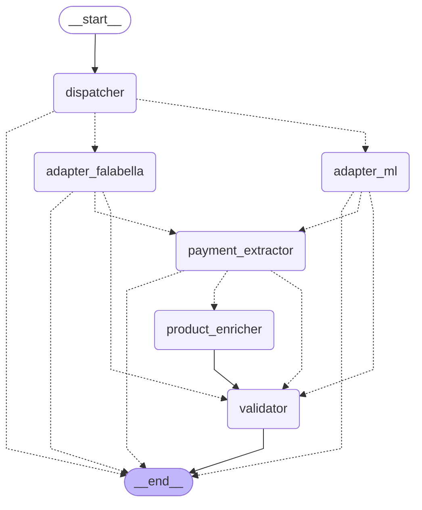

# TL LATAM Scraper

> Multi-Agent Scraping System for LATAM E-commerce — extracts payment methods
> from product URLs and returns structured JSON over an HTTP API.

Built for the **Tech Lead Assessment Part 2** (LATAM E-commerce Scraping Team —
Fintech). Combines deterministic adapters where data is reliable (public APIs)
with LLM agents where it isn't (rendered HTML / checkout DOM), orchestrated by
a LangGraph state machine.

- **Two sites supported**: Mercado Libre (LATAM-wide) + Falabella (CL/CO/PE/AR)
- **Two cooperating LLM agents**: PaymentExtractor (mandatory for Falabella) +
  ProductEnricher (conditional, runs only when adapter didn't capture title+price)
- **HTTP API**: `POST /scrape` returns `{site, product, payment_methods, metadata}`
  or a structured `error` object on failure
- **113 tests passing** (unit + smoke + E2E with HTTP MockTransport)

---

## Architecture

The pipeline is a **LangGraph `StateGraph`** with 6 nodes and 4 conditional
edges. Below is the actual diagram, generated by `python -c "from app.graph
import render_mermaid; print(render_mermaid())"` (so it's never out of sync
with the code):



**Solid arrows** (`-->`) are unconditional edges. **Dashed arrows** (`-.->`) are
conditional edges — the routing function decides which one is taken based on
state.

### Node responsibilities

| Node | Role | Cost |
|------|------|------|
| `dispatcher` | Resolves URL → `site_id` via regex on netloc. Pure function. | 0 LLM, 0 network |
| `adapter_ml` | `MercadoLibreAdapter`: hits public ML API (`/sites/{site}/payment_methods`, `/items/{id}`). Direct mode — no LLM needed. | 0 LLM, 1-2 HTTP |
| `adapter_falabella` | `FalabellaAdapter`: launches Playwright + stealth, captures PDP DOM, best-effort navigation toward checkout payment selector. Browser mode. | 0 LLM, 1+ HTTP |
| `payment_extractor` | **Agent #1** — Claude Haiku 4.5 with `tool_use` API. Compresses the DOM (1.6MB → 30KB via keyword-priority window) and returns a typed list of `PaymentMethod`. Mandatory for Falabella (skipped for ML). | 1 LLM call |
| `product_enricher` | **Agent #2** — same model, smaller prompt. Refines `title`/`price` if the adapter didn't capture them. **Best-effort**: failures don't break the response. Conditional on `product` being incomplete. | 0-1 LLM call |
| `validator` | Pure function: dedupes `(type, brand)` and asserts `len(payment_methods) >= 1`. Inserts `PARSE_ERROR` if empty. | 0 LLM |

### Adapter pattern: two modes, one interface

Every site adapter implements `app.adapters.base.SiteAdapter` (Protocol) and
returns an `AdapterResult` with one of two `mode` values:

- **`mode="direct"`** — adapter resolves the entire request (product +
  payment_methods) without browser or LLM. Used for Mercado Libre via the
  public API. The graph routes `adapter_ml → validator`, **skipping both LLM
  agents**. This is our cost-control happy path: $0 per request, ~300ms
  latency.
- **`mode="browser"`** — adapter only navigates and captures `initial_dom`.
  The two LLM agents (PaymentExtractor + ProductEnricher) live downstream in
  the graph. Used for Falabella because its product pages are JS-rendered and
  payment data is buried in the DOM, not exposed via API.

To add a new site, write an adapter, register it in `app/dispatcher.py`, and
add a node in `app/graph/scraper.py`. No changes to the API surface.

---

## Quickstart

### 1. Install

```bash
# Python 3.12+ required
pip install -e .
playwright install chromium
playwright install-deps chromium  # may need sudo on Linux
```

If you get errors about missing shared libraries (libnspr4 etc.) on Ubuntu:
```bash
sudo apt-get install -y libnspr4 libnss3 libdbus-1-3 libatk1.0-0 \
  libatk-bridge2.0-0 libcups2 libdrm2 libxkbcommon0 libxcomposite1 \
  libxdamage1 libxfixes3 libxrandr2 libgbm1 libpango-1.0-0 libcairo2 \
  libasound2 libatspi2.0-0
```

### 2. Configure

```bash
cp .env.example .env
# Edit .env and set ANTHROPIC_API_KEY
```

### 3. Run

```bash
uvicorn app.main:app --host 0.0.0.0 --port 8000
```

Verify:
```bash
curl http://localhost:8000/health
# {"status":"ok","version":"0.1.0","llm_configured":true,"model":"claude-haiku-4-5-20251001"}
```

### 4. Tests

```bash
pytest -q
# 117 passed in ~5s
```

Three categories of tests live in `tests/`:

- **Unit + smoke (default)** — 113+ tests covering schemas, dispatcher, ML
  adapter (httpx MockTransport), Falabella adapter (Playwright mocked),
  agents (Anthropic mocked), graph state machine (8 smoke tests), and
  E2E `/scrape` endpoint with mocks.
- **Offline LLM tests** (`tests/test_extractor_offline.py`) — call
  `extract_payment_methods()` against real HTML fixtures saved to
  `tests/fixtures/`. Run by default with mocked Anthropic; flip on real
  Anthropic with `pytest -m live` (~$0.003 total cost, requires
  `ANTHROPIC_API_KEY`).
- **Live regression** (`@pytest.mark.live`) — deselected by default.
  Calls Anthropic with the fixtures to validate that prompt + model
  combination still extracts critical brands (CMR, PSE, Webpay) under
  realistic DOMs. Use this after upgrading the model or refining the
  prompt.

### 5. Docker

```bash
# Build (~3 min the first time, ~30s after)
docker build -t tl-latam-scraper .

# Run with your local .env (must have ANTHROPIC_API_KEY set)
docker run --rm -p 8000:8000 --env-file .env tl-latam-scraper

# Smoke test (in another terminal)
curl http://localhost:8000/health
# {"status":"ok","version":"0.1.0","llm_configured":true,"model":"claude-haiku-4-5-20251001"}
```

The image uses `mcr.microsoft.com/playwright/python:v1.49.0-jammy` as base,
which ships Python 3.x + Chromium + all system shared libraries (libnspr4,
libnss3, etc.) preinstalled. Final image is ~2GB — large but eliminates
the most common deployment failure mode for Playwright-based services
("works on my machine"). Runs as non-root user `app` (uid 1000) for
security. Includes `HEALTHCHECK` against `/health` so orchestrators
(Docker Swarm, Kubernetes, ECS) can detect a stuck process.

For production: mount `.env` as a secret instead of `--env-file` (e.g.
`docker run -e ANTHROPIC_API_KEY=... -e MODEL_NAME=...`), and put the
container behind a reverse proxy that handles TLS.

---

## API

### `POST /scrape`

**Request:**
```json
{
  "url": "https://articulo.mercadolibre.com.ar/MLA-1135899085-apple-iphone-15",
  "country": "AR",
  "options": { "force_agents": false }
}
```

`country` and `options` are optional. The dispatcher infers country from URL
when possible.

**Success response (200):**
```json
{
  "status": "ok",
  "source_url": "https://articulo.mercadolibre.com.ar/MLA-1135899085-...",
  "site": "mercadolibre",
  "product": {
    "title": "Apple iPhone 15 128GB Rosa",
    "price": { "amount": 1299999.0, "currency": "ARS" }
  },
  "payment_methods": [
    { "type": "credit_card", "brand": "Visa", "installments": null },
    { "type": "credit_card", "brand": "Mastercard", "installments": null },
    { "type": "wallet",      "brand": "Mercado Pago", "installments": null },
    { "type": "cash",        "brand": "Rapipago", "installments": null }
  ],
  "metadata": {
    "duration_ms": 299,
    "agent_steps": 3,
    "llm_calls": 0,
    "llm_tokens": { "input": 0, "output": 0 },
    "payment_methods_source": "site_catalog"
  }
}
```

`payment_methods_source` is one of:
- `site_catalog` — from the site's public catalog (e.g. ML's `/sites/{site}/payment_methods`)
- `item_specific` — filtered by seller/item (more precise, when available)
- `captured_dom` — extracted from PDP DOM via LLM
- `captured_checkout_dom` — extracted from checkout DOM after add-to-cart navigation

**Error response (4xx/5xx):**
```json
{
  "status": "error",
  "source_url": "https://www.linio.com.co/p/...",
  "error": {
    "code": "UNSUPPORTED_SITE",
    "message": "No SiteAdapter registered for URL. Supported: Mercado Libre and Falabella.",
    "stage": "dispatcher"
  }
}
```

### Error code → HTTP status mapping

| `error.code` | HTTP | Meaning |
|--------------|------|---------|
| `INVALID_URL` | 400 | URL malformed or missing |
| `UNSUPPORTED_SITE` | 400 | No adapter for this domain |
| `OUT_OF_STOCK` | 404 | Product not found (HTTP 404 from site) |
| `LOGIN_REQUIRED` | 422 | Site redirected to login (per spec, we don't solve auth) |
| `LLM_BUDGET_EXCEEDED` | 429 | Anthropic key missing or rate-limited |
| `GEO_BLOCKED` | 451 | Site rejected request based on IP |
| `CHECKOUT_UNREACHABLE` | 502 | 5xx from origin |
| `ANTI_BOT_DETECTED` | 502 | CAPTCHA/Cloudflare challenge |
| `PARSE_ERROR` | 502 | Adapter ran but extracted no methods |
| `TIMEOUT` | 504 | Total request budget exceeded |
| `INTERNAL_ERROR` | 500 | Unexpected — bug in our code |

`X-Correlation-ID` header is set on every response for traceability.

---

## Eval harness

`scripts/eval.py` runs a defined set of cases against a live server and
reports pass/fail with operational metrics (latency, llm_calls, n_methods).
It's the single command a reviewer can run to validate the whole system
end-to-end with one report.

```bash
# 1. Start the server in one terminal
uvicorn app.main:app --host 0.0.0.0 --port 8000

# 2. In another terminal, run the eval
python scripts/eval.py
```

What you get:
```
Eval harness -- target http://localhost:8000
  Cases file: scripts/cases.yaml (5 cases)
  /health OK

Running cases:
  PASS ml_listing_iphone (0.30s)
        Mercado Libre listing format -- happy path, 0 LLM calls, sub-second.
        HTTP 200  site=mercadolibre  n_methods=20  source=site_catalog  llm=0  server_ms=210
  PASS ml_catalog_iphone (0.15s)
        ...
  PASS linio_unsupported (0.04s)
        ...
  - falabella_co_tv (--skip-falabella)

Summary:
  Total cases: 5  (4 ran, 1 skipped)
  Passed:  4
  Total time: 0.62s
```

Cases are defined declaratively in `scripts/cases.yaml`. Each case
specifies a URL and a list of assertions (expected HTTP status, minimum
methods, required brands, max latency, etc.). To add a new case, just
append to the YAML — no code change.

Common flags:
- `python scripts/eval.py --skip-falabella` — skip Playwright cases (~80s
  saved, useful for iteration)
- `python scripts/eval.py --case ml_listing_iphone` — run a single case
- `python scripts/eval.py --json reports/eval_results.json` — also dump
  results as JSON (for CI integration)
- Exit code: `0` all passed, `1` at least one failed, `2` config error

This is the harness an evaluator (or CI) can use to validate the
delivery without reading the code first.

---

## Test URLs

Three URLs to validate the system end-to-end. Run after `uvicorn` is up.

### Example 1 — Mercado Libre (listing format)

```bash
curl -s -X POST http://localhost:8000/scrape \
  -H "Content-Type: application/json" \
  -d '{"url":"https://articulo.mercadolibre.com.ar/MLA-1135899085-apple-iphone-15-128-gb-rosa-_JM"}' \
  | jq '{site, n: (.payment_methods|length), source: .metadata.payment_methods_source, llm: .metadata.llm_calls, ms: .metadata.duration_ms}'
```

**Expected:**
```json
{ "site": "mercadolibre", "n": 20, "source": "site_catalog", "llm": 0, "ms": 299 }
```
(20 payment methods canonicalized from the ML public API; sub-second; 0 LLM calls.)

### Example 2 — Mercado Libre (catalog format `/p/`)

```bash
curl -s -X POST http://localhost:8000/scrape \
  -H "Content-Type: application/json" \
  -d '{"url":"https://www.mercadolibre.com.ar/apple-iphone-15-128-gb-negro/p/MLA1027172677"}' \
  | jq '{site, product: .product, n: (.payment_methods|length), llm: .metadata.llm_calls}'
```

**Expected:** Same `payment_methods` count, `product.title` derived from URL slug
(catalog `/p/` URLs require a different ML endpoint that's currently
rate-limited from datacenter IPs — the adapter degrades gracefully).

### Example 3 — Falabella (CL/CO PDP)

```bash
curl -s -X POST http://localhost:8000/scrape \
  -H "Content-Type: application/json" \
  --max-time 180 \
  -d '{"url":"https://www.falabella.com.co/falabella-co/product/73499632/televisor-lg-75-pulgadas/73499632"}' \
  | jq '{site, n: (.payment_methods|length), source: .metadata.payment_methods_source, llm: .metadata.llm_calls, ms: .metadata.duration_ms}'
```

**Expected:**
```json
{
  "site": "falabella",
  "n": 1,
  "source": "captured_checkout_dom",
  "llm": 1,
  "ms": 76659
}
```

The single method captured (`CMR` with installments) is the promotional badge
visible in the cart preview. **See "Known Limitations" below** — Falabella's
full payment selector is gated behind a shipping-address form that we
intentionally do not bypass.

### Example 4 — Unsupported site (negative test)

```bash
curl -s -X POST http://localhost:8000/scrape \
  -H "Content-Type: application/json" \
  -d '{"url":"https://www.linio.com.co/p/algun-producto-12345"}' \
  | jq
```

**Expected (HTTP 400):**
```json
{
  "status": "error",
  "error": {
    "code": "UNSUPPORTED_SITE",
    "message": "No SiteAdapter registered for URL. Supported: Mercado Libre and Falabella.",
    "stage": "dispatcher"
  }
}
```

---

## Decisions Log

The five trade-offs that drove the architecture, with the reasoning that
should hold up in a defense interview.

### 1. Mercado Libre via public API, not DOM scraping

ML exposes `/sites/{site_id}/payment_methods` publicly. Hitting this returns
the full catalog as structured JSON in ~200ms with zero LLM tokens. Scraping
the rendered PDP would require Playwright (heavy, slow), an LLM call to
extract methods (~$0.001), and would lose category-specific data the API
already encodes (e.g. installments per method).

**Trade-off**: ML's `/items/{id}` endpoint is rate-limited from datacenter
IPs and frequently returns 403. We accepted this as graceful degradation:
the adapter returns `product=null` (or a slug-derived title) when blocked,
but `payment_methods` is always served because the catalog endpoint is not
rate-limited.

### 2. LangGraph for orchestration, not imperative `if/else`

The spec calls out **LangGraph or CrewAI** as required. Beyond compliance,
the StateGraph gives us:
- A diagram (the one above) auto-generated from the code, never stale.
- Conditional edges as pure functions of state — easy to unit test
  (`test_graph_falabella_path_invokes_extractor_skips_enricher`).
- A clean separation between routing logic (`route_after_*`) and node logic.
- Errors propagated as `state['error']` instead of exceptions, so the graph
  always terminates cleanly and the endpoint converts to structured JSON.

**Trade-off**: LangGraph adds a dependency and a learning curve. For a
pipeline this small, the value is the diagram + the contract. For a larger
pipeline (10+ nodes, retries, parallel branches) it pays back tenfold.

### 3. Two LLM agents, both with `tool_use` for structured output

- `PaymentExtractor` (mandatory for Falabella): parses compressed DOM,
  returns typed `PaymentMethod[]` with `installments`.
- `ProductEnricher` (conditional): refines `title`/`price` when adapter
  selectors miss them.

Why two and not one mega-agent: separation of concerns means each prompt
is short, each tool schema is focused, and we can skip the second one when
not needed. The conditional edge `route_after_extractor` checks
`product.title and product.price` and routes to `validator` directly,
saving one LLM call (~$0.0003).

We use Anthropic's `tool_use` API (not free-form JSON parsing) because:
- Schema validation is enforced server-side by Anthropic.
- No need for `json.loads()` retry loops on malformed output.
- Model is forced via `tool_choice={"type": "tool", "name": "..."}`.

### 4. DOM compression: keyword-priority window, not full pass

Falabella's checkout DOM is ~1.6 MB. Sending that to Haiku would cost ~$0.05
and slow the request to 30s+. `app/agents/dom_utils.compress_dom()` strips
scripts/styles/svg/comments, then picks the 30 KB window with the most
payment keywords (`pago, tarjeta, cuotas, Visa, Mastercard, PSE, ...`).

Result: ~5% of the original size, all the signal. Cost drops to ~$0.0005.

### 5. Capture preview, do NOT bypass auth/address forms

The spec **prohibits** solving CAPTCHAs and complex login flows. We extend
this principle: synthesizing shipping-address data to advance through
Falabella's checkout would also cross a line (it's not "input we have", it's
data we're fabricating to defeat the site's UX).

We capture what's reachable (the cart preview, with its CMR + installments
promo) and surface a structured error if no methods are found. The `source`
field in metadata communicates the granularity to the caller, who can then
decide how to consume it.

---

## Known Limitations

### Falabella checkout requires shipping address

Falabella CO/CL/PE block the full payment selector behind a shipping-address
form (with cascading dropdowns + Google Maps confirmation). Without (a)
solving login or (b) fabricating user data, we cannot reach the page that
exposes all 7 methods (CMR, Tarjeta crédito, Débito Banco Falabella, Tarjeta
débito, Gift Card, PSE, Pago en efectivo).

**Current behavior**: the adapter clicks `Agregar al carro → Ir al carro`,
captures the DOM at that point, and the LLM extracts whatever payment
preview is visible (typically CMR + installments, the promoted badge).
`metadata.payment_methods_source` is set to `captured_checkout_dom` to
distinguish this case from the ML catalog path.

**Future Work**: a site-specific Falabella adapter could ship with
synthetic test data per country, gated behind an `--allow-synthetic` flag,
for QA environments where this is acceptable. We chose not to do this in
the assessment to stay aligned with the spec.

### Mercado Libre `/items/{id}` is datacenter-rate-limited

ML returns HTTP 403 for `/items/` requests from cloud/datacenter IPs (verified
2026-05-05 from a WSL2 environment). The public `payment_methods` endpoint
remains accessible, so the system still returns useful data; only `product`
fields may be `null` or fall back to URL-slug-derived titles.

**Future Work**: residential proxy rotation, or a thin HTML scrape of the
product page as a third fallback. Out of scope for an 8-hour assessment.

### Falabella runs Playwright headless — no anti-bot evasion

We use `playwright-stealth` for basic fingerprint masking. We do **not**
solve Cloudflare challenges, hCaptcha, or reCAPTCHA. When the adapter
detects these, it returns `ANTI_BOT_DETECTED` (HTTP 502) with a clear
message — no silent failure.

---

## Project layout

```
app/
├── adapters/
│   ├── base.py              # SiteAdapter Protocol + AdapterResult
│   ├── mercadolibre.py      # ML public-API adapter (mode=direct)
│   └── falabella.py         # Falabella Playwright adapter (mode=browser)
├── agents/
│   ├── dom_utils.py         # compress_dom() with keyword-priority window
│   ├── payment_extractor.py # LLM Agent #1 — tool_use API
│   └── product_enricher.py  # LLM Agent #2 — conditional, best-effort
├── graph/
│   ├── __init__.py
│   └── scraper.py           # LangGraph StateGraph (6 nodes, 4 conditional edges)
├── schemas/
│   ├── request.py           # ScrapeRequest (Pydantic)
│   ├── response.py          # ScrapeResponseSuccess + metadata
│   ├── error.py             # ScraperError + 11 ErrorCodes + Stage enum
│   └── catalog.py           # Brand canonicalization (Visa, MC, PSE, ...)
├── config.py                # pydantic-settings, .env-driven
├── dispatcher.py            # URL → site_id (regex)
├── logging.py               # structlog + correlation_id middleware
└── main.py                  # FastAPI app; /scrape invokes the graph
tests/                       # 113 tests, ~5s
├── test_dispatcher.py       # 23 — URL routing
├── test_schemas.py          # 25 — Pydantic validation
├── test_ml_adapter.py       # 19 — ML adapter w/ httpx MockTransport
├── test_falabella_adapter.py# 19 — Falabella adapter (Playwright mocked)
├── test_agents.py           # 11 — DOM compressor + LLM agents (Anthropic mocked)
├── test_graph.py            #  8 — LangGraph state machine smoke tests
├── test_endpoint_ml.py      #  5 — E2E /scrape (HTTP)
└── test_health.py           #  3 — /health endpoint
```

---

## Cost & latency analysis

Measured on the URLs in "Test URLs" above.

| Path | LLM calls | Tokens (in/out) | Latency | Cost (Haiku 4.5) |
|------|-----------|-----------------|---------|-------------------|
| ML listing (happy) | 0 | 0 / 0 | ~300 ms | $0 |
| ML catalog (degraded) | 0 | 0 / 0 | ~250 ms | $0 |
| Falabella PDP-only (fallback) | 1 | ~14k / ~100 | ~30-40 s | ~$0.0005 |
| Falabella + checkout nav | 1-2 | ~14k / ~100 | ~75-90 s | ~$0.0005 |

Pricing reference (Haiku 4.5 as of 2026-05): input $1/M tokens, output $5/M.

For 1000 requests/day with this mix (80% ML, 20% Falabella), monthly cost
is dominated by Anthropic at ~$3-5/month — comfortably below any reasonable
budget for a payment-methods data feed.

---

## Future Work

- **Site-specific adapters with synthetic checkout data** for QA environments
  (Falabella all-7-methods requires this; gated behind `--allow-synthetic`).
- **Residential proxy rotation** to lift the ML `/items/` rate limit.
- **Eval harness** (`scripts/eval.py` + `tests/cases.yaml`) — a one-shot
  script that runs the test URLs and compares against expected JSON
  fixtures, for CI integration.
- **More sites**: Amazon MX/BR, Linio, Ripley, Paris. The adapter pattern
  makes this additive — no graph changes.
- **Caching layer** for ML's `/sites/.../payment_methods` (TTL ~1h) to push
  ML latency below 50ms.
- **Observability**: export `agent_steps`, `llm_calls`, `duration_ms`,
  `payment_methods_source` to Prometheus for SLO dashboards.

---

## Author

Sergio Iván Villamizar Delgado — AI Manager @ Dichter & Neira. PhD in Electrical Engineering
(Data Analysis), Universidad Nacional de Colombia.
